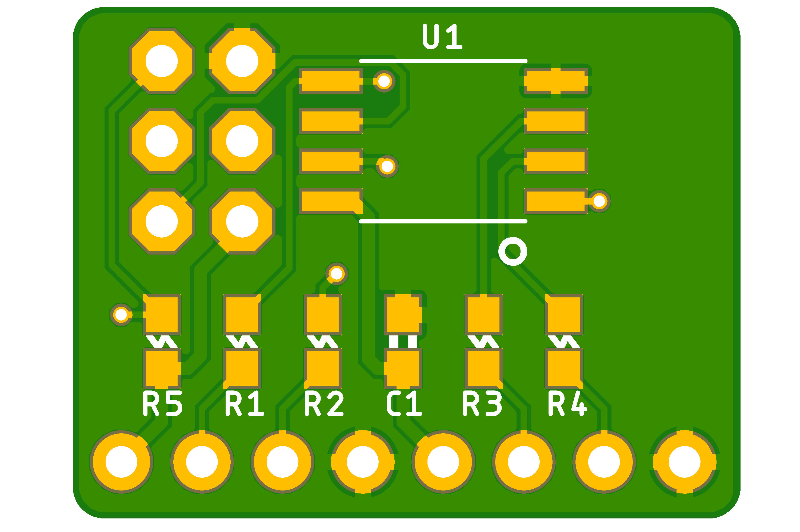
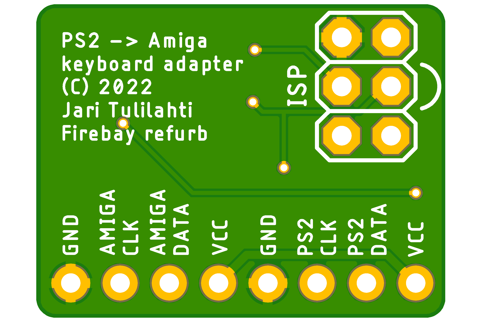

# PS2toAmiga
Simple ATTiny85 based PS/2 to Amiga protocol converter that fits inside the keyboard.

The project was born as an idea to get small and color-matching keyboard to my old
Commodore Amiga CD32 console, in order to make it more Amiga-like, in use with
TerribleFire 330. I found few projects around The Net which did the same thing but some
of them used old and almost unobtainable ICs with closed firmware and some didn't work
that well.

Many projects used just way too big chip for the job, which I felt was a waste of precious
silicon, as you only need 2 input and 2 output pins for the job - ATTiny85 was chosen as
it's one of my favorite "all 'round" chip for simple tasks.

I wanted the adapter to sit inside the keyboard and use the CD32 AUX-connector (PS/2 style
mini-DIN) as-is for cable.

Of course the keyboard protocol is the same in all Amigas, the pinouts just differ, so this
project can be used to create replacement keyboard for the lost one to your bigger Amigas
as well (like Amiga 2000, 3000 & 4000 etc.)

## How it works

PS/2 keyboard protocol in it's basic level isn't that hard, it is bidirectional synchronous
serial port with clock (CLK) and data (DATA) lines, communicating with PS/2 keyboard using
microcontroller has been done multiple times already - which is why I chose to use
PS2KeyAdvanced library for Arduino to handle that task - I didn't want to re-invent the wheel,
and I had used PS2KeyAdvanced in earlier projects as well. 

## Installing

See [PS2KeyAdvanced](https://github.com/techpaul/PS2KeyAdvanced) project for install instructions,
for some reason the version 1.0.9 failed to install into my pretty recent Arduino install, but
version 1.0.8 worked as well.

For ATTiny85 support I used [ATTinyCore](https://github.com/SpenceKonde/ATTinyCore), again check
their respective site for install instructions to your Arduino IDE.

## PCB

### Top side:

### Bottom side:

