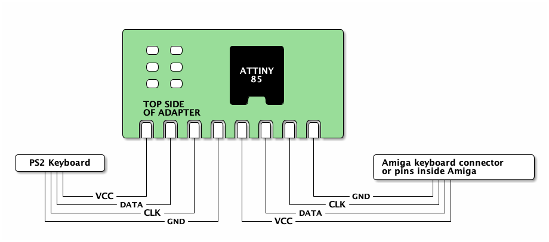

# PS2toAmiga
Simple ATTiny85 based PS/2 to Amiga keyboard protocol converter that fits inside the keyboard.

The project was born as an idea to get small and color-matching keyboard to my old
Commodore Amiga CD32 console, in order to make it more Amiga-like, in use with
TerribleFire 330. I found few projects around The Net which did the same thing but some
of them used old and almost unobtainable ICs with closed firmware and some didn't work
that well.

Many projects used just way too big chip for the job, which I felt was a waste of precious
silicon, as you only need 2 input and 2 output pins for the job - ATTiny85 was chosen as
it's one of my favorite "all 'round" chip for simple tasks.

I wanted the adapter to sit inside the keyboard and use the CD32 AUX-connector (PS/2 style
mini-DIN) as-is for cable.

Of course the keyboard protocol is the same in all Amigas, the pinouts just differ, so this
project can be used to create replacement keyboard for the lost one to your bigger Amigas
as well (like Amiga 2000, 3000 & 4000 etc.)

## How it works

PS/2 keyboard protocol in it's basic level isn't that hard, it is bidirectional synchronous
serial port with clock (CLK) and data (DATA) lines, communicating with PS/2 keyboard using
microcontroller has been done multiple times already - which is why I chose to use
PS2KeyAdvanced library for Arduino to handle that task - I didn't want to re-invent the wheel,
and I had already used PS2KeyAdvanced in earlier projects as well. It also has nice support
for Caps Lock, Num Lock etc.

The keycodes read from PS/2 keyboard using PS2KeyAdvanced are then translated to the respective
Amiga keycode and sent to wire, using
[Amiga keyboard protocol](http://amigadev.elowar.com/read/ADCD_2.1/Hardware_Manual_guide/node0172.html).

The converter-code also keeps track of user pressing CTRL-Amiga-Amiga simultaneously and
implements [resetting the Amiga](http://amigadev.elowar.com/read/ADCD_2.1/Hardware_Manual_guide/node0179.html)
when those keys are pressed. In PS/2 keyboard, Windows-keys are mapped to respective
Amiga-keys on both sides of the space bar. Also if your keyboard misses the Windows/Menu -keys,
the Left and Right Amiga keys are mapped to F11 and F12 respectively.

Code itself is "quick'n'dirty" -style but should be pretty much commented out so you can modify
the internals of it to your own needs - if you have any.

## Installing

See [PS2KeyAdvanced](https://github.com/techpaul/PS2KeyAdvanced) project for install instructions,
for some reason the version 1.0.9 failed to install into my pretty recent Arduino install, but
version 1.0.8 worked as well.

For ATTiny85 support I used [ATTinyCore](https://github.com/SpenceKonde/ATTinyCore), again check
their respective site for install instructions to your Arduino IDE.

After installing ATTinyCore and PS2KeyAdvanced, load the project into your Arduino IDE and 
select following settings:

- **Board:** ATtiny24/45/85 (No bootloader)
- **Chip:** ATtiny85
- **Clock Source**: 16 MHz (PLL)
- **TImer 1 Clock:** CPU frequency
- **LTO:** Enabled
- **millis():** Enabled

#### Steps to install to ATTiny85:

Use whatever ISP programmer you have. I used cheap USBASP programmer with 10 -> 6 pin adapter cable,
having header pins in ISP connector and then pushing the connector into ISP holes (no header soldered)
and keeping them tilted in an angle during programming.

1. Tools -> Burn bootloader (actually only sets fuses, and enables 16MHz PLL clock)
2. Sketch -> Verify/Compile
3. Upload using programmer

You should be done now, if not, verify your programmer connections. I also have had issue sometimes
programming the new parts, which are set to 1MHz default in factory - you might need to change your
Arduino settings to slow down the programmer for Fuse burning.

## Connecting the adapter

Wiring the keyboard to your Amiga and PCB should be pretty obvious in the following diagram:

If that is not clear enough, the underside of the PCB has each pin function named.

Several Amigas have different pinouts, Google is your friend here.

**Word of warning:** if you think of re-using the PS/2 keyboard cable, be warned that most of
the keyboards only have 4-wire cable in them and probably the necessary pins are not connected
at all (at least if the Amiga you want to connect to has mini-DIN style keyboard connector).
I solved this issue by ordering PS/2 extension cable and just cutting off the female plug and
then using multimeter to solve cable colors to pins connection. Those extension cables usually
have all the 6 wires connected and it's much easier to use them than to solder those pesky
mini-DIN connectors.

## PCB

PCB files are in [pcb](pcb/) -folder, also including [gerbers](pcb/gerbers/), if you just want
to order the PCB. Schematics are respectively in [schematics](schematics/) -folder.
Bill of Materials, [BOM](schematics/BOM.txt) is also provided.

PCB and Schematics were designed using Eagle 9.6.1 free edition.

### Top side:

### Bottom side:

### Other

Please report any [issues](https://github.com/Jartza/PS2toAmiga/issues) you find with the code!

You can also participate in [discussions](https://github.com/Jartza/PS2toAmiga/discussions) without opening an issue. All enhancement ideas, questions etc. are welcome.
